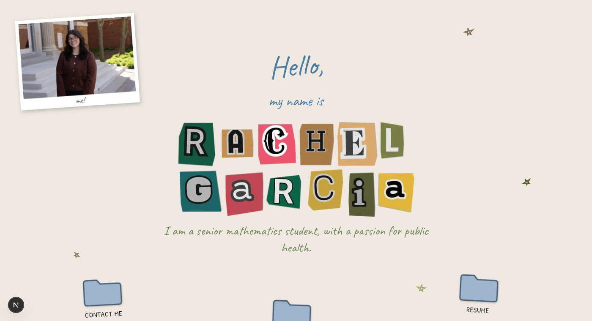

# rachelgarcia.com

Personal portfolio site for Rachel Garcia — a playful desktop-style page where folders open draggable windows for contacts, projects, and resume.



## Stack

- Next.js (App Router) + TypeScript, plain CSS Modules
- Content stored as JSON in Vercel Blob with a built-in seed fallback
- Hidden password-protected admin at `/admin` for editing content and uploading files
- Deployed on Vercel

## Development

```bash
npm install
npm run dev
```

Create a `.env.local` with:

```
ADMIN_PASSWORD=
SESSION_SECRET=
```

